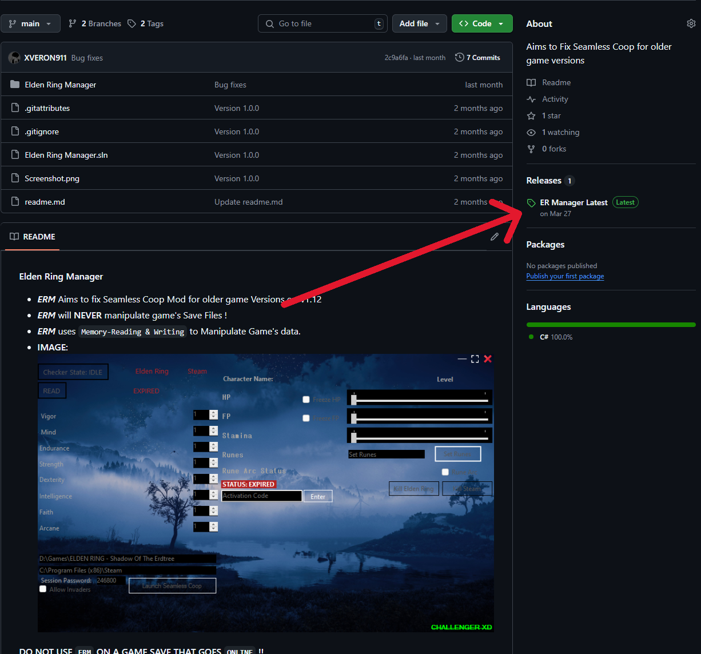
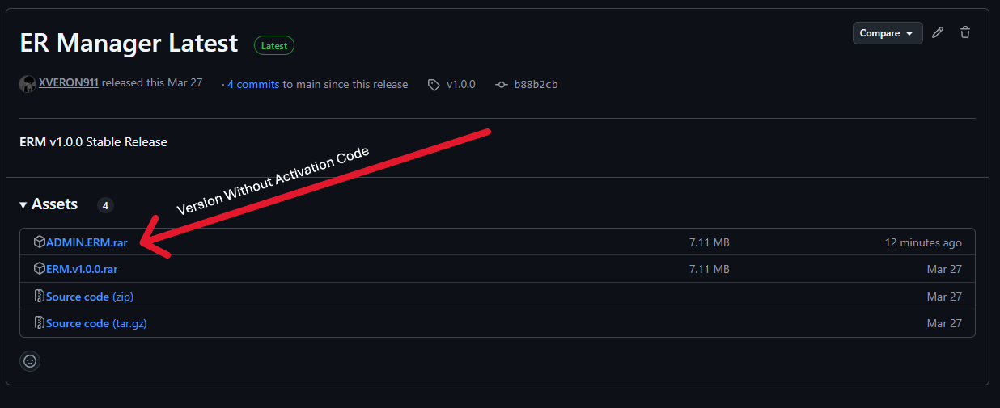
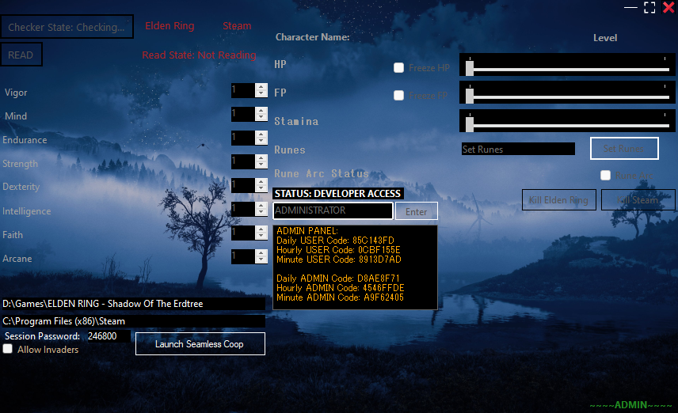

```cs
#IF YOU WANT TO USE THE SOFTWARE WITHOUT ACTIVATION CODE
#USE ADMIN-ERM SCREENSHOTS Below:
```
```diif
-ERM ONLY RUNS WITH ADMINISTRATOR PERMISSIONS AND WILL NOT WORK WITHOUT IT
-DOWNLOAD ERM (Follow Screenshots below and download ADMIN.ERM.rar)
-EXTRACT THE CONTENTS OF THE .RAR FILE
-RUN 'ERM ADMIN' AS ADMINISTRATOR
```



**Elden Ring Manager (ERM)**
- ***ERM*** Aims to fix Seamless Coop Mod for older game Versions ex: v1.12  
- ***ERM*** will **NEVER** manipulate the game's Save Files !
- ***ERM*** uses `Memory-Reading & Writing` to Write the Game's data
- **ERM** Works with Cracked/Pirated versions of the game

```yaml
-ERM need Elden Ring & Steam paths in your drive (First use only):
Example:
D:\Games\ELDEN RING - Shadow Of The Erdtree
C:\Program Files (x86)\Steam

-ERM need you to set up the Session password & whether to allow invaders or not (First use only):

-Launch Seamless Coop will Attempt to launch the Game with Seamless Coop and bypass it's known Error:

-Checker State -> Periodically checking for the Game & Steam if running or not:

-Read Button will read the game's Memory so it can fetch Player Stats, Health and more..:

-Freeze HP/FP will run a script that will keep them on the last number you set in ERM::

-Set Runes has a maximum amount of Runes you can give as the Game will crash if you gave more:

-Rune Arc Status will activate the Rune you have (instead of the ingame Rune Arc):

-Kill Elden Ring / Kill Steam will attempt to kill the process:
```
```diff
-DO NOT PRESS READ BUTTON WHILE IN MAIN MENU OR LOADING SCREEN
-DO NOT CHANGE HP/FP VALUES WHILE FREEZE IS ON (ERM IS WRITING THE SAME DATA YOU ARE CHANGING)
-MAKE SURE OF THE STEAM PATH BEFORE LAUNCHING SEAMLESS COOP THROUGH ERM (FIRST TIME ONLY)
-LAUNCH SEAMLESS COOP BUTTON IS INTENDED FOR OLDER GAME VERSIONS
-DO NOT USE LAUNCH SEAMLESS COOP WITH A WORKING SEAMLESS COOP (NEWER) GAME VERSION
```


<br>
 **DO NOT USE `ERM` ON A GAME SAVE THAT GOES `ONLINE` !!**  
 **I DIDN'T COLLABORATE WITH ``SEAMLESS COOP OWNER`` TO MAKE ``ERM``**
 Sorry For Bad Quality GIFs
<br>

```diff
-Building forv DEVELOPERS ONLY:
Recommended branch is test. (ADMIN branch)
C# Development Kit & .NETFramework For Visual Studio
Clone Project and Open .sln File
main branch is for the Software requiring Activation Dode
test branch is for the Software NOT requiring Activation Code (ADMIN)
```

**Copyright (C) 2025 ``VERON911 || CHALLENGER``**  
**You may NOT redistribute, modify, or sell this software without permission.**  
**Credits to: [Massivetwat](https://github.com/Massivetwat)'s [Swed64](https://github.com/Massivetwat/Swed64) Library.**
<br>
``This Software main purpose is to fix SeamlessCoop Error and Was tested on Elden Ring Version 1.12 Only and may NOT work as Expected For newer or older Versions of the game``
<br>
*Discord: berlin0698*  
*REDDIT: [Sensitive-Arma](https://www.reddit.com/user/Sensitive-Arma/)*  
